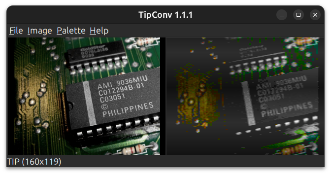
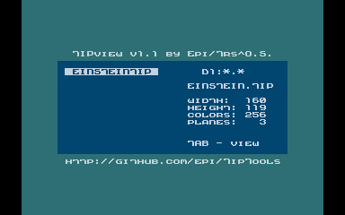

TipTools is a collection of utilities for creation and viewing of images
in TIP (Taquart Interlaced Picture) format.

# TipConv

TipConv is a PC utility to convert images to TIP (or HIP) format.



## Requirements

Any PC with any OS running JRE6 or later, which must be already installed.

## Usage

Run *tipconv.jar* by double-clicking it or typing:

```shell
java -jar tipconv.jar
```

An empty window will appear on screen. Load an image (.jpg, .gif, .png, or so)
using the **File > Open** menu option.
The image will be automatically resized, so it's not necessary to that in advance.
There are three resize modes, which are explained below.

Select conversion options under **Palette** menu, and then select **Image > Convert**
or press **F5** to perform the conversion and display the resulting image.
Try different settings until you achieve a satisfying result.

It's also possible to change the display palette to see how the image will display in different conditions.

Save the converted image via **File > Save as** menu option.
The image will be saved in format selected with **Image > Format** before the conversion.

## Menu options

- **Image > Format** – Select target image format. Currently, there are two options:
TIP 0.1, as read by TipView, and HIP. The image format also defines maximum image
resolution, which is 119 lines (or 238 scanlines) for TIP and 200 lines for HIP.

- **Image > Resize** – Select resize the way the image will be resized before the conversion:
  - **Fit** – image is resized to fit the maximum size, depending on
    selected format and respecting the original aspect ratio.
  - **Crop to fill** – image is resized to fill the entire display area for the
    selected format, respecting image aspect ratio, and thus it may also be cropped.
  - **Stretch to fill** – image is resized to fill the entire display area for the
    selected format, and the original aspect ratio is not preserved.
- **Palette > Conversion** – Select palette used for conversion.
  Currently, this option affects the TIP format only.
- **Palette > Display** – Select palette used for display.
- **Palette > Saturation** – Increase saturation before converting the image.
  Use this option if the converted image contains more grayscale pixels than you expected.
- **Palette > Brightness** – Choose whether input pixel brightness should be mapped to
  GTIA brightness as defined in the selected palette (**Palette**) or linearly (**Linear**).
  For the HIP format, linear mapping is used regardless of this choice.

## Using additional palette files

Palette files are stored inside *Palette/* folder. Palette file name should end
with *.act* extension and the file should consist of 256 triples of bytes,
each triple describing the R, G, and B components of successive GTIA colours.

## Command line interface

Beginning with version 1.1.0, TipConv can be used as a command line tool,
which enables batch conversion.

Type:

```shell
java -jar tipconv.jar --help
```

To see the command line usage information.

# TipView



TipView is an image viewer mainly created as a reference viewer for TIP images,
but it supports also other popular Atari 8-bit image formats, including:
HIP, CIN, CCI, PLM, GR8, GR9, MIC, and PIC.

TipView starts in the file selector mode, in which you can browse through
drives and directories (MyDOS and SpartaDOS subdirectories are supported)
and select an image to load.

The following keys control the file selector mode:

- **Space** – read current directory,
- **1**-**9** – select drive,
- **-**, **=** – move cursor up/down,
- **Return** – load and display file under cursor, or enter subdirectory,
- **Tab** – display previously loaded image,
- **Esc** – return to DOS.

While an image is displayed, the following keys are available:

- **-**, **=** - load and display previous/next file in the current directory,
- **Space**, **Tab** - return to file selector.
